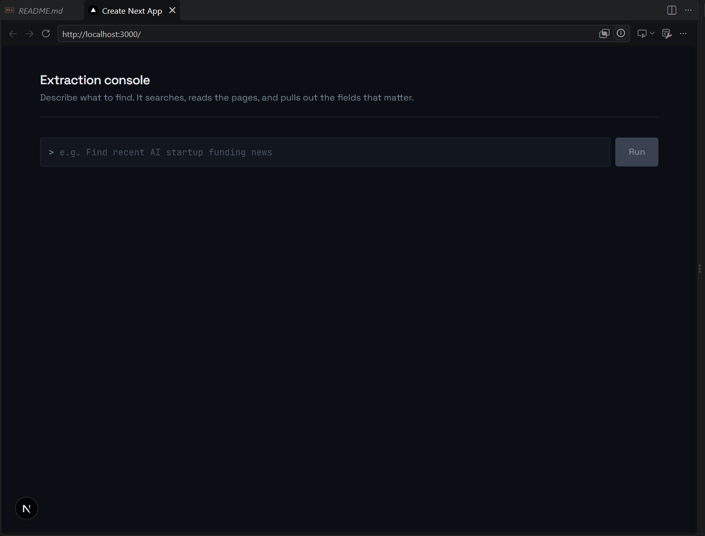
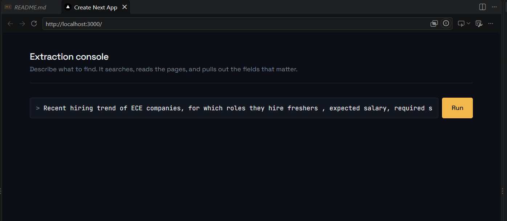
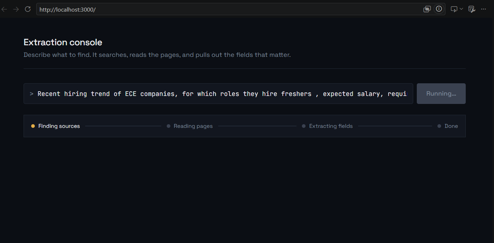
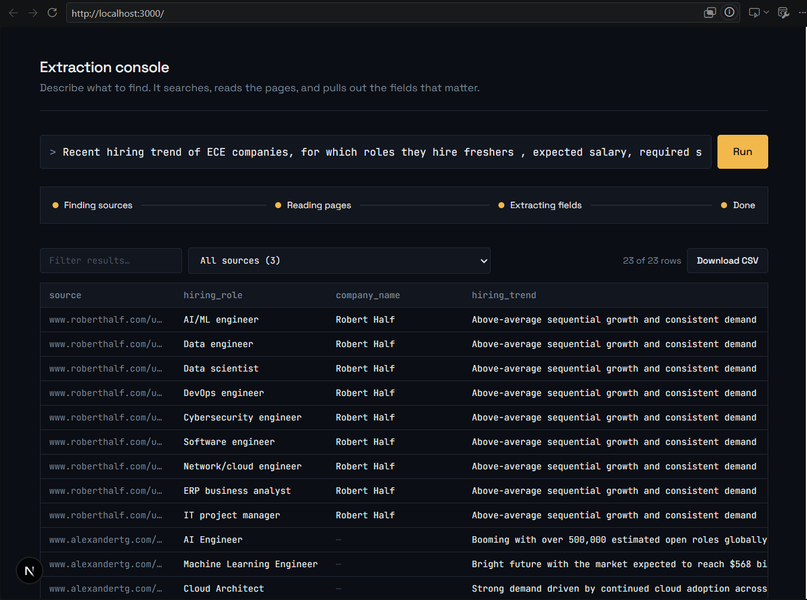
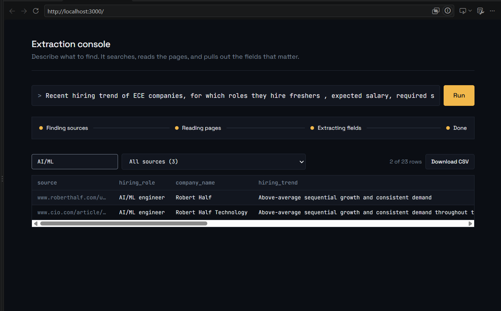
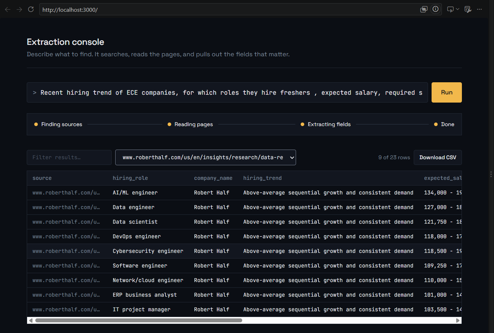
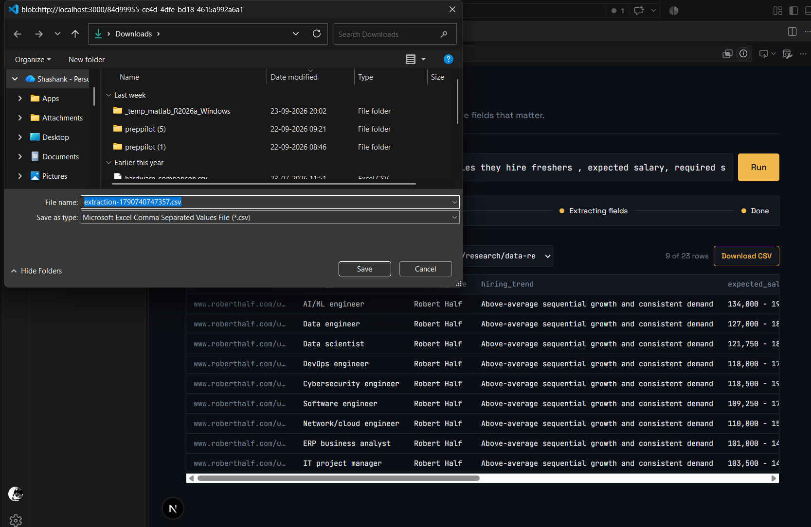

# AI Data Intelligence Platform

## Prototype Preview

These screenshots show the working prototype: a natural-language prompt, live workflow progress, structured extraction results, source filtering, sorting, and CSV export.

| Prototype result | Prototype result |
| --- | --- |
|  |  |
|  |  |
|  |  |



## What I Built

I built the AI Data Intelligence Platform to make web research faster and more useful.

Normally, collecting structured information from the web means searching across many pages, copying details into a spreadsheet, deciding which fields matter, and cleaning duplicate results by hand. This project turns that process into one simple workflow.

I can describe what I want in plain English, such as:

> Find recent AI startup funding news

The platform searches for relevant sources, reads the pages, understands which fields are important, extracts the information into structured records, and shows the results in a live dashboard.

## Why It Matters

The goal is not just to use AI to generate an answer. The goal is to create useful, structured, and traceable data.

Every extracted record keeps the URL of its source, so I can verify where the information came from. The result can then be searched, filtered, sorted, and downloaded as a CSV file for further analysis.

This makes the platform useful for research, market intelligence, lead discovery, news monitoring, and other tasks where information must be collected from multiple web sources.

## Main Features

### Plain-English requests

I do not need to write a scraper or configure a fixed data model for every new question. I simply describe the information I need in the prompt bar.

### Dynamic fields for every request

Different questions need different information. Gemini creates a suitable extraction schema for each prompt instead of forcing every request into the same columns.

For example, a request about startup funding may produce fields such as company name, funding amount, investors, date, and summary. A request about job openings may produce company, role, location, salary, and application URL.

### Multi-source web research

Tavily searches the web and finds relevant public URLs for the request. The workflow can collect information from several sources instead of depending on a single page.

### Page crawling and extraction

Crawl4AI and Playwright fetch the discovered pages and convert their content into clean text. Gemini then extracts records from that content using the generated schema.

### Source traceability

Each result includes its original source URL. This makes it possible to check the source instead of treating the extracted data as an unexplained answer.

### Cleaning and deduplication

The backend removes exact duplicate records before saving the results. This keeps the final dataset more useful and easier to export.

### Live progress tracking

The dashboard shows the workflow as it moves through these stages:

1. Finding sources
2. Reading pages
3. Extracting fields
4. Completing the dataset

### Search, filter, sort, and export

After the workflow finishes, I can:

- Search across extracted values and source URLs
- Filter records by source
- Sort the dynamic columns
- Download the visible results as a CSV file

### Saved workflows

Each request and its results are stored in Supabase. The backend also provides an endpoint for listing recent workflows, which gives the project a foundation for workflow history and future user accounts.

## How the Platform Works

```text
User prompt
    |
    v
FastAPI backend
    |
    +--> Tavily discovers relevant URLs
    |
    +--> Gemini creates a dynamic extraction schema
    |
    +--> Crawl4AI reads the pages
    |
    +--> Gemini extracts structured records
    |
    +--> Duplicate records are removed
    |
    +--> Supabase stores workflows and results
    |
    v
Next.js dashboard
    |
    +--> Live status
    +--> Search and filters
    +--> Sortable results table
    +--> CSV export
```

## Project Structure

```text
ai-data-platform/
├── backend/
│   ├── main.py              # FastAPI application and API routes
│   ├── engine.py            # Search, schema, crawling, extraction, and dedupe
│   ├── database.py          # Supabase connection
│   ├── requirements.txt     # Python dependencies
│   ├── .env.example         # Environment variable template
│   ├── Dockerfile           # Backend deployment image
│   └── supabase_schema.sql  # Database tables and policies
├── frontend-app/            # Complete Next.js application
│   ├── app/                 # Dashboard page and global styles
│   ├── components/          # Reusable UI components
│   ├── lib/api.ts           # API client and shared types
│   └── package.json
└── frontend/                # Earlier frontend implementation kept for reference
```

## Technology Used

- **Next.js and React** for the interactive dashboard
- **TypeScript** for frontend code
- **FastAPI** for the Python API
- **Gemini** for dynamic schemas and structured extraction
- **Tavily** for web search and source discovery
- **Crawl4AI and Playwright** for reading web pages
- **Supabase/PostgreSQL** for storing workflows and extracted data
- **Docker** for packaging the backend for deployment

## Running the Project Locally

### 1. Set up Supabase

I first create a Supabase project and run [`backend/supabase_schema.sql`](backend/supabase_schema.sql) in the Supabase SQL Editor.

The schema creates two main tables:

- `workflows`: stores prompts, statuses, generated schemas, errors, and timestamps.
- `extracted_data`: stores extracted JSON payloads and their source URLs.

From **Project Settings > API**, I copy the project URL and API key.

### 2. Configure the backend

From the project root:

```bash
cd backend
python -m venv .venv
```

Activate the environment:

```bash
# Windows PowerShell
.venv\Scripts\Activate.ps1

# macOS/Linux
source .venv/bin/activate
```

Install the Python dependencies and browser runtime:

```bash
pip install -r requirements.txt
python -m playwright install --with-deps chromium
```

I create `backend/.env` with these values:

```dotenv
SUPABASE_URL=https://your-project.supabase.co
SUPABASE_KEY=your-supabase-key
GEMINI_API_KEY=your-gemini-api-key
TAVILY_API_KEY=your-tavily-api-key
ALLOWED_ORIGINS=http://localhost:3000
```

Then I start the backend:

```bash
uvicorn main:app --reload --port 8000
```

The health check is available at [http://localhost:8000](http://localhost:8000).

### 3. Run the dashboard

In a second terminal:

```bash
cd frontend-app
npm install
npm run dev
```

The frontend uses `http://localhost:8000` by default. To point it at another backend, I create `frontend-app/.env.local`:

```dotenv
NEXT_PUBLIC_API_URL=http://localhost:8000
```

I then open [http://localhost:3000](http://localhost:3000), enter a request, and select **Run**.

## API Endpoints

The backend exposes a small API for the dashboard and future integrations:

| Method | Endpoint | What it does |
| --- | --- | --- |
| `GET` | `/` | Confirms that the API is running |
| `POST` | `/api/workflows/start` | Starts a workflow from a prompt |
| `GET` | `/api/workflows` | Lists recent workflows |
| `GET` | `/api/workflows/{id}/status` | Returns workflow status and metadata |
| `GET` | `/api/workflows/{id}/results` | Returns extracted records |

A workflow moves through `pending`, `searching`, `crawling`, `extracting`, `completed`, or `failed`.

## Example API Request

```bash
curl -X POST http://localhost:8000/api/workflows/start \
  -H "Content-Type: application/json" \
  -d '{"prompt":"Find recent AI startup funding news"}'
```

The response includes a `workflow_id`. The frontend uses that ID to poll progress and load the final records.

## Demo Reliability

Live web crawling can be affected by network conditions or third-party rate limits. For demonstrations, I can save a successful workflow ID in the `DEMO_CACHE` dictionary in [`backend/main.py`](backend/main.py):

```python
DEMO_CACHE = {
    "find recent ai startup funding news": "workflow-uuid-here",
}
```

When the same prompt is entered again, the backend can return the completed workflow immediately.

## Deployment

The backend includes a [`Dockerfile`](backend/Dockerfile), so it can be deployed to Render or another container platform. The required backend environment variables are:

- `SUPABASE_URL`
- `SUPABASE_KEY`
- `GEMINI_API_KEY`
- `TAVILY_API_KEY`
- `ALLOWED_ORIGINS`

The `frontend-app` directory can be deployed to Vercel or another Next.js-compatible platform with:

```dotenv
NEXT_PUBLIC_API_URL=https://your-backend.example.com
```

After deploying the frontend, I add its URL to the backend's `ALLOWED_ORIGINS` value so browser requests are accepted.

## Security Notes

- I never commit `backend/.env` or `frontend-app/.env.local`.
- API keys stay on the backend and are never exposed through `NEXT_PUBLIC_*` variables.
- In production, `ALLOWED_ORIGINS` should contain only trusted frontend domains.
- The included Supabase policies are intentionally broad for this demo. A production version should add authentication and user-specific Row Level Security policies.

## What I Would Build Next

The current version proves the core research workflow. Natural next steps would be:

- User authentication and private workspaces
- More granular source citations for individual fields
- Scheduled recurring workflows
- Additional export formats and integrations
- Improved retry and rate-limit handling
- Richer workflow history and saved searches

## License

No license has been specified for this project yet.
# AI Data Intelligence Platform

## What I Built

I built the AI Data Intelligence Platform to make web research feel more like asking a question than writing a scraper.

When I need structured information from the web, I can describe the request in plain English, such as:

> Find recent AI startup funding news

The platform then searches for relevant sources, reads those pages, decides which fields are important, extracts the information, removes duplicate records, and displays the results in a clean dashboard.

The goal is simple: turn an open-ended research question into useful, structured, and traceable data.

## Why I Built It

Collecting information from the web usually means switching between search engines, browser tabs, spreadsheets, and custom scripts. That process is slow, repetitive, and difficult to reuse.

I wanted to build a system where the user only needs to explain what they are looking for. The platform handles the research workflow behind the scenes and returns data that can be searched, reviewed, filtered, sorted, and exported.

This approach is useful for tasks such as:

- Finding companies that match specific criteria
- Collecting market or competitor research
- Monitoring recent news and announcements
- Building contact or opportunity lists
- Turning public web research into spreadsheet-ready data

## What the User Experiences

1. The user enters a request in natural language.
2. The platform finds relevant public web sources.
3. AI creates an extraction plan based on that specific request.
4. The platform reads and processes the selected pages.
5. AI extracts structured records from the content.
6. Duplicate records are removed.
7. The results appear in a dynamic table with source URLs.
8. The user can filter, sort, search, and download the data as CSV.

While the workflow is running, the dashboard displays its progress through these stages:

- Finding sources
- Reading pages
- Extracting fields
- Done

## Main Features

### Natural-language research

The user does not need to know a scraping language or define a database schema in advance. They simply describe the result they want.

### Dynamic fields for every request

Different questions need different information. Instead of using one fixed table for every task, Gemini creates a small extraction schema for each prompt. A request about startups might produce fields such as company name, industry, location, and funding amount, while a news request might produce title, date, summary, and organization.

### Multi-source discovery

Tavily searches for relevant public pages based on the user's request. The workflow can collect information from multiple sources rather than depending on a single page.

### Structured extraction

Crawl4AI reads each page and converts it into clean content. Gemini then extracts records into a predictable JSON structure. This makes the results easier to display, export, and use in another application.

### Source traceability

Every extracted record keeps its source URL. This makes it possible to review where the information came from instead of treating the AI output as an unexplained answer.

### Search, filtering, sorting, and export

The dashboard supports text search across the result data, filtering by source, sortable columns, and CSV export. The downloaded file contains the source URL together with the extracted fields.

### Progress and failure states

The backend saves workflow status as the job runs. The dashboard polls that status and shows whether the workflow is searching, crawling, extracting, completed, or failed.

### Stored workflows

Workflows and extracted records are stored in Supabase. The backend also exposes an endpoint for listing recent workflows, which provides a foundation for history, monitoring, and future user accounts.

## How the Technology Works

The project has two main parts:

- **Frontend**: a Next.js and React dashboard where the user submits prompts and explores results.
- **Backend**: a FastAPI service that coordinates search, crawling, AI extraction, deduplication, and storage.

The main processing pipeline is:

```text
User prompt
    ↓
Tavily source discovery
    ↓
Gemini dynamic schema generation
    ↓
Crawl4AI page crawling
    ↓
Gemini structured extraction
    ↓
Duplicate removal
    ↓
Supabase storage
    ↓
Live results dashboard
```

## Project Structure

```text
ai-data-platform/
├── backend/
│   ├── main.py              # FastAPI routes and workflow status handling
│   ├── engine.py            # Search, crawling, extraction, and deduplication
│   ├── database.py          # Supabase connection
│   ├── requirements.txt     # Python dependencies
│   ├── .env.example         # Environment variable template
│   ├── Dockerfile           # Backend container configuration
│   └── supabase_schema.sql  # Database tables and policies
├── frontend-app/            # Complete runnable Next.js application
│   ├── app/                 # Main page and global styles
│   ├── components/          # Dashboard components
│   ├── lib/api.ts           # Frontend API helpers
│   └── package.json
└── frontend/                # Earlier frontend component version
```

## Running the Project Locally

### 1. Set up the database

I use Supabase to store workflows and extracted records.

1. Create a project at [supabase.com](https://supabase.com/).
2. Open the Supabase **SQL Editor**.
3. Run [`backend/supabase_schema.sql`](backend/supabase_schema.sql).
4. Copy the project URL and API key from **Project Settings > API**.

The schema creates two main tables:

- `workflows`: stores the original prompt, status, generated schema, errors, and timestamp.
- `extracted_data`: stores each extracted record, its workflow ID, payload, and source URL.

### 2. Configure and run the backend

I use Python for the API and extraction workflow.

```bash
cd backend
python -m venv .venv
```

Activate the environment:

```bash
# Windows PowerShell
.venv\Scripts\Activate.ps1

# macOS/Linux
source .venv/bin/activate
```

Install the dependencies and browser runtime:

```bash
pip install -r requirements.txt
python -m playwright install --with-deps chromium
```

Create `backend/.env` with these values:

```dotenv
SUPABASE_URL=https://your-project.supabase.co
SUPABASE_KEY=your-supabase-key
GEMINI_API_KEY=your-gemini-api-key
TAVILY_API_KEY=your-tavily-api-key
ALLOWED_ORIGINS=http://localhost:3000
```

Start the backend:

```bash
uvicorn main:app --reload --port 8000
```

I can check that it is running by opening [http://localhost:8000](http://localhost:8000). The API returns a health response when it is ready.

### 3. Configure and run the frontend

In a second terminal:

```bash
cd frontend-app
npm install
```

The frontend connects to `http://localhost:8000` by default. To configure another backend URL, create `frontend-app/.env.local`:

```dotenv
NEXT_PUBLIC_API_URL=http://localhost:8000
```

Start the dashboard:

```bash
npm run dev
```

I can then open [http://localhost:3000](http://localhost:3000), enter a prompt, and select **Run**.

## API Endpoints

The FastAPI backend exposes these endpoints:

| Method | Endpoint | What it does |
| --- | --- | --- |
| `GET` | `/` | Checks that the service is running |
| `POST` | `/api/workflows/start` | Starts a workflow from a prompt |
| `GET` | `/api/workflows` | Lists the latest workflows |
| `GET` | `/api/workflows/{id}/status` | Returns progress and workflow metadata |
| `GET` | `/api/workflows/{id}/results` | Returns the extracted records |

To start a workflow directly from a terminal:

```bash
curl -X POST http://localhost:8000/api/workflows/start \
  -H "Content-Type: application/json" \
  -d '{"prompt":"Find recent AI startup funding news"}'
```

The response includes a `workflow_id`, which can be used to check the status and retrieve results.

## Demo Reliability

Web crawling depends on external websites and network conditions, so I added an optional demo cache. After a successful workflow, I can map the exact prompt to its completed workflow ID in `backend/main.py`:

```python
DEMO_CACHE = {
    "find recent ai startup funding news": "workflow-uuid-here",
}
```

When that prompt is entered again, the backend returns the saved workflow immediately. This is useful for a presentation while the live workflow remains available for other prompts.

 

## What I Would Build Next

The current project is a working foundation for AI-powered web research. The next improvements I would make include:

- User accounts and private workflow history
- More granular source citations for individual fields
- Retry and rate-limit handling for external services
- Background job processing for larger workloads
- Additional export formats and integrations
- Saved searches and scheduled monitoring

## License

No license has been specified for this project yet.
